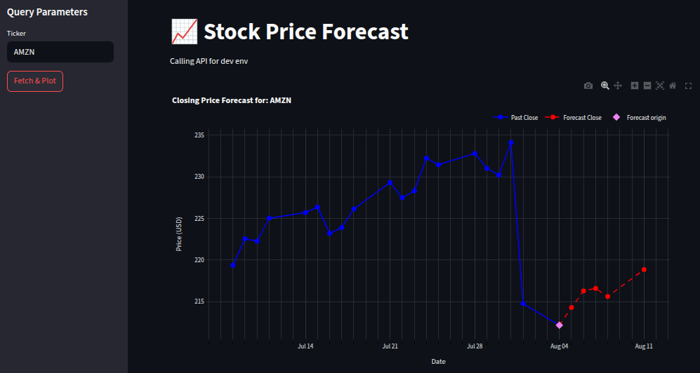
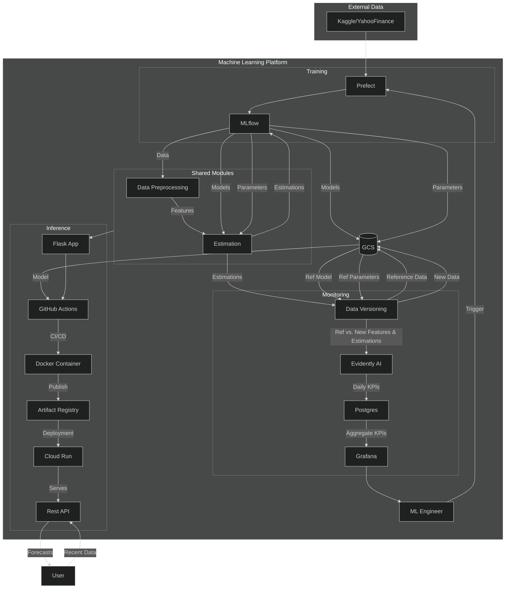
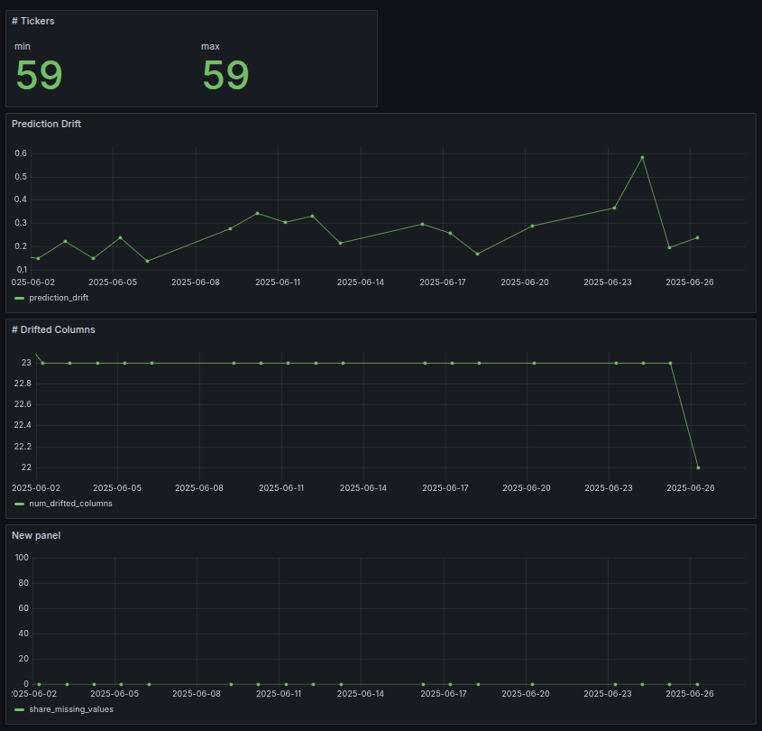

[](https://github.com/OnurKerimoglu/stocks_forecasting_live/actions/workflows/ci.yml)
[](https://github.com/OnurKerimoglu/stocks_forecasting_live/actions/workflows/cd.yml)

# Stocks Forecasting

## Motivation and Objectives
Investing in the stock market requires insights into the target tickers -and ideally a view on where prices are headed. While long-term price movements are driven by fundamentals such as a company’s financial health and sector conditions, short-term behaviour is often swayed by recent price action and traders’ reactions. That short-term signal may be partially predictable, and this project is one such attempt.

My priority has not been to craft *the* perfect model so far, but to build an end-to-end, fully automated infrastucture - from training to live inference - using industry-standard MLOps tools and practices. The system should:

- **Expose an inference endpoint** that forecasts 5-day (multi-step) returns for any stock ticker, even those unseen at training time (a global model).
- **Support rapid experimentation** with new features and model algorithms, while registering full model lineages.
- **Monitor data and model performance** continuously and identify potential drifts.
- **Enable managing cloud resources with IaC** so the entire stack can be spun up—or torn down—in one command.

### 🔮 Live Inference Demo

A first model is already online as a REST API (technical details below). I decided not to publish it openly to avoid potentially excessive costs, but here a simple [Streamlit app](deploy_demo/demo.py) to give it a try: https://stocks-forecasting.streamlit.app.

<https://your-streamlit-url.app> &nbsp;|&nbsp; Source: [`deploy_demo/demo.py`](deploy_demo/demo.py)

> **Heads-up:** the demo is hosted on Streamlit Community Cloud for now, so an idle app may take a few seconds to wake up.
> Once it’s running, enter the ticker symbol, click `Fetch and Plot`, and you’ll see a chart like this, combining the latest historical data with the 5-day forecast:


## Tech stack and Solution Architecture

| Process | Tooling |
|---------|---------|
| Infrastructure as Code | **Terraform** |
| Experiment tracking & model registry | **Mlflow** |
| Store & version models / training artifacts | **Google Cloud Storage (GCS)** |
| Orchestrate and schedule workflows | **Prefect** |
| Expose REST API | **Flask** |
| Containerization and image storage | **Docker** + **Artifact Registry** |
| Autoscale & deploy | **Cloud Run** |
| Data & model monitoring | **Grafana + Evidently AI** |
| Code quality | **Ruff** (lint/format) + **Pytest** (unit tests) |
| CI/CD | **GitHub Actions** |


Here is an L3 flowchart of the solution architecture (may require a mermaid previewer extension for correct visualisation on your IDE. See the [documentation](documentation/documentation.md) for a more colorful, png version):



## Instructions for Reproduction
### Prerequisites and Initial Setup
- The [training dataset](https://www.kaggle.com/datasets/nelgiriyewithana/world-stock-prices-daily-updating/data) will be downloaded either via Yahoo! Finance API (https://pypi.org/project/yfinance/) or Kaggle API (which requires signing up and creating an API token, see: https://www.kaggle.com/docs/api))
- The installation instructions below assumes availability of uv on your system (https://docs.astral.sh/uv/getting-started/installation/)
- On a terminal, run:
```
git clone https://github.com/OnurKerimoglu/stocks_forecasting_live.git   # clone the project repo
cd stocks_forecasting_live                  # cd into project repo
uv venv  # creates a virtual environemnt    # Create a venv
source .venv/bin/activate                   # Activate the venv
uv sync                                     # Install the dependencies as specified in pyproject.toml and uv.lock
uv pip install -e .                         # Install the project as a package (`uv pip install -e .`)
pre-commit install                          # Enable pre-commit hooks
```
#### Notes
- The repository has 2 main branches, `dev` and `prod`, default being `dev`.
- All project dependencies, and their transitive dependencies are provided by [pyproject.toml](pyproject.toml) and [uv.lock](uv.lock), respectively
- With [Makefile](Makefile) certain operations are automated, as will be referred below.
- [ruff](https://docs.astral.sh/ruff/) is used as linter and formatter. Issue `make quality_checks` to run the quality checks manually.
- [pytest](https://docs.pytest.org) is used as the testing framework. Issue `make tests` to run the (so far only unit) tests manually.
- [pre-commit](https://pre-commit.com/) hooks will be enabled by the last command above. Only the default hooks, private key detection and linting/formatting hooks are specified (see the [config](.pre-commit-config.yaml))

### Cloud Infrastructure

This project uses GCP services for deployment, managed by [Hashicorp Terraform](https://developer.hashicorp.com/terraform) (see: [terraform/main.tf](terraform/main.tf)). For being able to reproduce the steps that depend on cloud resources:
- Create a project on GCP
- Create a service account with the following roles:
  - Artifact Registry Administrator
  - Cloud Functions Admin
  - Service Account User
  - Service Usage Admin
- Create a key for the service account and download it to your machine
- In your shell, a variable GOOGLE_APPLICATION_CREDENTIALS should be pointing to the location of this key file. This can be achieved by, e.g., inserting `export GOOGLE_APPLICATION_CREDENTIALS=<path_to_your_gcp_key>` to your .bashrc.
- Install [gcloud CLI](https://cloud.google.com/sdk/docs/install)
- Create a file named 'terraform.tfvars' in the terraform directory that contains the path to your service account key
- Adapt the contents of [config/gcs.yml](config/gcs.yml)
- In the terraform directory:
  - `terraform init`: to initilize the backend and provider (google) plugins
  - `terraform apply`, and when prompted confirm: to generate the resources
- In the cloud, three environments are defined: `prod`, `dev` and `test`. The former two correspond to the primary branches of the git repository, whereas any other branch (e.g., `feature/xyz`) is supposed to communicate with the `test` environment.


### Training Worfklow
The training workflow is described in [documentation](./documentation/documentation.md#workflow). For experimenting the feature engineering and model-specific options and choosing the best model, Mlflow is used, and the whole workflow is orchestrated by Prefect. Operational instructions are provided in the next sections.

#### Experiment Tracking and Model Registry
is handled by [mlflow](https://mlflow.org/). To activate mlflow server, simply open a new terminal, activate the venv and issue `make mlflow_serve` (see the [Makefile](Makefile)). On a browser, navigate to `http://localhost:5000` to access the Mlflow GUI. To stop the server, hit Ctrl+C on the terminal.  See [the documentation](./documentation/documentation.md#experiment-tracking-and-model-registry) for the details on experiment tracking and model registry.

#### Initiating the Orchestrator
is handled by [prefect](https://www.prefect.io/) (will be installed as a dependency). The workflow deployment requires activation of the mlflow server first (previous section), and comprise the following steps:
- Start the prefect server: activate the .project venv on a terminal (see above), and issue `make prefect_serve` (see the [Makefile](Makefile)). Then on a browser, navigate to `http://localhost:8080` to access the GUI.
- Create a work pool: once the prefect server is running (previous step), open a new terminal, after activating the project venv, issue: `make prefect_create_workpool`. Note that this step is required only once, and will actually return an error if repeated
- Deploy the training workflow and start the worker: once the server has started and a worker pool is created (previous 2 steps), issue `make prefect_deploy_train`. Note that this command will call the [deploy_training_worfklow.py](scripts/deploy_training_workflow.py) script with `env` argument that will be derived from the active branch (`dev` and `prod` branches map to the envrionments with the same names, whereas any other branch will map to `test`), which in turn will deploy the environment-specific training workflow. The environment will determine two aspects of deployment:
  - schedule: weekly training schedule for the `prod` environment, otherwise (`dev`, `test`) none
  - source: for `test` environment the deployment will be sourced from the local file system, otherwise (`dev`, `prod`) from the respective branch of the remote repository (i.e. the state correspoding to that of github). The deployed workflows can be seen in the GUI, Deployments tab. The status should become 'Ready', once the worker has started (may take a few seconds).

To stop the worker, and the prefect server, hit Ctrl+C in the respective terminals.

#### Manually Triggering an Experiment on the Training Pipeline

A manual run can be triggered on the `dev` and `test` deployment (on `prod` deployment too, but that one is intended for scheduled runs, see the previous section). The run can be triggered, e.g., on the GUI, Deployments tab, 'Play' button on the top-right corner. Three parameters can be optionally set via 'Custom Run':
  - env (default: 'prod'): this will determine the storage location of the sampled data on GCS
  - use_sample_tickers_for_training (default: True): Only two tickers (['AMZN', 'APPL']) will be used to train the model (these two tickers will be used for the model evaluation anyway, independent of the selection here)
  - select_only_latest (default: True): if True, the best model run will be selected only among runs from the current date, i.e., ignoring the previous runs

### Inference Pipeline
The inference pipeline, i.e., the 'stocks_forecasting_inference_flow' function in [main_inference.py](main_inference.py):
- accepts either of:
  - the recent price data () with which the forecasts will be made
  - the ticker symbol, for which the recent data will be retrieved from yahoo finance
- runs the data preprocessing and feature engineering pipelines (based on the 'champion' parameters so that the data processing for the model training can be reproduced - see the [documentation](documentation/documentation.md))
- runs the champion model (see the next section)
- returns the forecasts and the requested amount of recent data

The inference service exposes a REST API (implemented with [Flask](https://palletsprojects.com/projects/flask/)) with two POST endpoints: /v1/forecast/from_data and /v1/forecast/from_symbol—for forecasting from user-supplied price data or by ticker symbol, respectively. Here is an overview:

| Method | Path                        | Description                                                 | Example json payload |
|:------:|-----------------------------|-------------------------------------------------------------|------------------------|
| POST   | `/v1/forecast/from_symbol`  | Forecasts by ticker symbol; the service fetches recent data  | ```{"ticker": "AAPL", "past_horizon": 10}``` |
| POST   | `/v1/forecast/from_data`    | Forecasts using user-provided recent (closing) price data | ```{"ticker": "AAPL", "series": {"date":  ["2025-07-21", "2025-07-22", ...], "close": [231.14,       233.02,      ...]}, "past_horizon": 1}``` |

See the following sections for the instructions on building, deploying and testing the service.

#### Local Build and Deployment
Building the inference pipeline is a two-step process:
1. Model extraction from mlflow: issue `make extract_registered_model`, only after making sure that the mlflow server is running (if not `make mlflow_serve`). This will query mlflow and get the run_id of the model lineage registered with alias 'champion' (i.e., last version) in the 'stocks_forecasting_candidates' stack, and copy the `model.pkl` and `requirements.txt` artifacts as well as the parameters as `params.json` into an `data/extracted_model` folder under project root (after removing its previous contents), and sync the contents of this folder with the GCS `models_bucket` bucket defined in [config/gcs.yml](config/gcs.yml), depending on the current branch that sets the environment (`prod`->`prod`, `dev`->`dev`, otherwise `test`).
2. Building the container image:  issue `make inference_build_local`. After triggering the `quality_checks` and `tests` targets (see [initial setup](#prerequisites-and-initial-setup)) to catch any obvious flaws, and checking whether the branch is clean state, the [deploy_inference/Dockerfile](deploy_inference/Dockerfile) will pack all necessary files and install packages needed for serving the inference pipeline. The current branch name (in sanitized form) and the (short) SHA of the latest commit will be appended to the tag of the Image-URI to allow tracibility.

For testing local code  (e.g., a feature branch that has not been published yet), this container can be deployed locally with `make inference_serve_local`. This will start the flask app at `http://0.0.0.0:9696`

#### Manual Deployment to Cloud Run
Assuming that the [Cloud Infrastructure](#cloud-infrastructure) instructions have been successfully executed, three steps are needed for deployment:
1. Build the image locally (see above). The active branch will suffix the image tag (`prod`->`-prod`, `dev`->`-dev`, otherwise `-test`).
2. Publish the image to [Google Artifact Registery](https://cloud.google.com/artifact-registry/docs) (GAR): issue `make inference_publish`
3. Deploy the image (respective of the active branch) in GAR to [Cloud Run](https://cloud.google.com/run?hl=en): issue `make inference_deploy`. The active branch will suffix the service name (`prod`->`-prod`, `dev`->`-dev`, otherwise `-test`).

Note that, as the second step is a dependency of the third, and the first is a depednency of first, issuing directly the third will cascadingly trigger the first two.

Once the deployment is done, a Service URL will be displayed. Note that this is a revision-specific URL that will change with every deployment. `cloud run services describe` with the correct parameters can provide the stable URL. The Makefile target `inference_test_raw` sends a curl command for a default ticker to the service url based on the active branch and  return the raw output.

### CI/CD Pipeline

#### Continuous Integration:
Any pull request to the main branches (`dev`, `prod`) will trigger the CI workflow on GitHub actions as defined in [.github/workflows/ci.yml](ci.yml). The CI Pipeline performs the quality (linting) checks (ruff check; ruff format) and unit tests with pytest (see the [Notes](#notes) under Prerequisites and Initial-Setup section)

#### Continuous Deployment:
Any successful merge to the `prod` branch will trigger the CD workflow (see [.github/workflows/cd.yml](cd.yml)), which simply automates the build-publish-deploy chain described above ([manual deployment](#manual-deployment-to-cloud-run)).


### Testing the Deployments
Besides the `inference_test_raw` Makefile target explained under the [Manual Deployment to Cloud Run](#manual-deployment-to-cloud-run), the helper function [test_inference.py](scripts/test_inference.py) can be used to test deployments. The script can make use of local deployments or remote (cloud run) deployments through the parameter `env`: while `prod`, `test` and `dev` will use the service url of the respective cloud run deployment, `local` will use the service url of a local deployment, hence requires serving of a local image (see [Local Build and Deployment](#local-build-and-deployment) section above). The script accepts two additonal arguments: `ticker`, the ticker symbol to be forecasted, and `past_horizon`, number of past days to be returned (1 implies the last day available, which is also the forecast origin).

Example: assuming that a deployment has been made from a non-primary (anything other than `dev` or `prod`) branch (see [Manual Deployment to Cloud Run ](#manual-deployment-to-cloud-run)), so that a `test` cloud run service is available, the example function call: `python scripts/test_inference.py --env test --ticker GOOG --past_horizon 5` will send a request for the ticker=GOOG to the stable url of the test service, parse the output and return something like:
```=== PAST PRICES ===
             Close
2025-07-28  232.79
2025-07-29  231.01
2025-07-30  230.19
2025-07-31  234.11
2025-08-01  214.75

=== FORECAST ===
             Close Returns (%)
2025-08-04  216.09       0.63%
2025-08-05  216.50       0.19%
2025-08-06  216.60       0.05%
2025-08-07  217.86       0.58%
2025-08-08  218.27       0.19%
```

`Make inference_test_pretty` will call the script for the current active branch for a default ticker.

### Monitoring
Monitoring is achieved through:
1. Building and running the services (only once):
    - issuing `docker compose -f monitoring/docker-compose.yml build` will build the docker images of all necessary services ([Grafana](https://grafana.com/) as the dashboarding tool, a [Postgres](https://www.postgresql.org/) DB and [Adminer](https://www.adminer.org) as the DB management tool, see: [docker-compose.yml](monitoring/docker-compose.yaml))
    - issuing `docker compose -f monitoring/docker-compose.yml up` will start running the services. With the default configuration (see [grafana_datasources.yaml](monitoring/config/grafana_datasources.yaml)), Adminer should be accessible on localhost:8085 (with System: PostgreSQL, Username: postgres, Pw: admin, Database: stocks) and Grafana should be accessible on localhost:3000 (with default user: admin and pw:admin).
2. Data archival: every time the training pipeline is run, the date-sampled & cleaned data is stored in a GCS bucket defined in [gcs.yml](config/gcs.yml)
3. Establishing the baseline: to define and store the model and data that will form the baseline, the script [establish_baseline.py](monitoring/establish_baseline.py) should be executed by specifying the environment from which the stored model artifacts should be pulled, and the filename for the cleaned and sampled data. This is exemplified in the [Makefile](Makefile) with the `monitoring_establish_baseline` target. This is a manual step so far.
4. Refreshing the dashboard: to compare a new dataset (e.g., a new pull from Kaggle or Yahoo! Finance) against the ref dataset, and predictions generated with the new dataset and the reference model, the script [evidently_dashboard.py](monitoring/evidently_dashboard.py) should be run with the necessary arguments. This is exemplified with a [Makefile](Makefile) target `monitoring_base_refresh` (If you don't have the data with the filename on your system, it won't work)
    - localrun: whether the data should be pulled from local filesystem (to set it to False, provide no-localrun instead)
    - env: in which env folder/prefix (i.e., cleaned_samples_dev) the new data is stored
    - fname: file name of the new data (e.g., "Kaggle_Access_2025-07-28_WSPall_from_2020-07-28.parquet")
    - backfill_horizon: number of (business) days (backwards from the last available date) monitoring dashboard should be refreshed for
5. Inspection of results: in Grafana -> Dashboards -> a dashboard named 'Base Monitoring' (sourced from [base_monitoring.json](monitoring/dashboards/base_monitoring.json))  will be available, that should look like:


## License

This project is licensed under the MIT License, with a [Commons Clause](https://commonsclause.com/) restriction that prohibits commercial use without a separate license.

See [LICENSE](./LICENSE) for full details.
