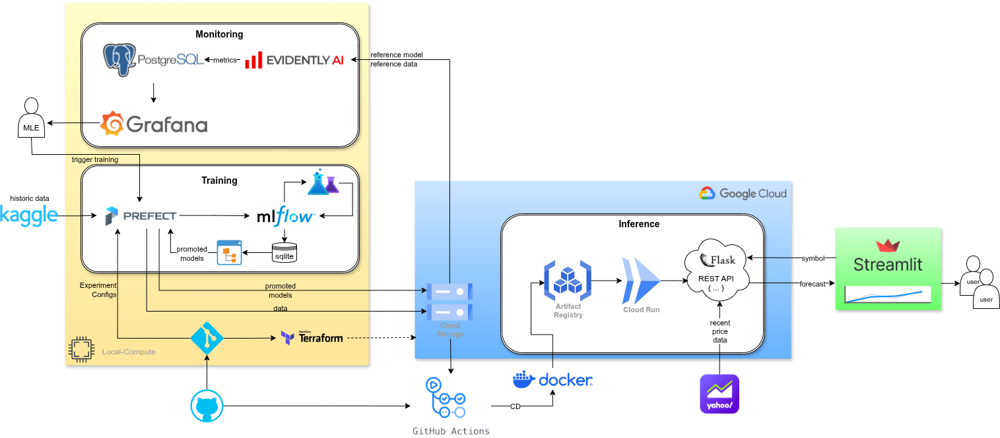
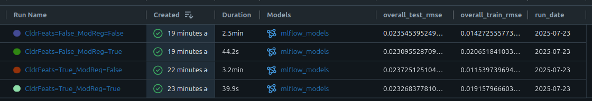
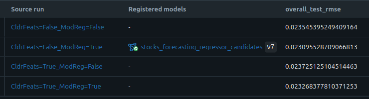

# Documentation

Here a more colorful flowchart than shown in the readme:



## Model Training

### Workflow
Training workflow, i.e., stocks_forecasting_training_flow `flow` provided by the [main_training.py](../main_training.py), consists of 4 `task`s:
1. Base data preparation (task)
    - Get the raw data
    - Clean the raw data
    - Sample tickers and dates
    - Split train and test
2. Run experiments (task)
    - Prepare features
    - Train the model
    - Evaluate the model
    - Log the model, parameters, metrics to mlfow
3. Register the best model (task)
4. Cleanup (task)

### Experiment Tracking and Model Registry
Experiments will be conducted according to the configuration files in the `config`  directory under the project root. Here, the factors and their levels to be experimented with are provided as a yaml file, which will be read by [create_experiments.py](../src/create_experiments.py), and converted to an experiment dictionary following a full factorial design. For example, config file [Exp_CldrFeats_ModReg.yaml](../config/Exp_CldrFeats_ModReg.yaml):
```
factor_levels:
  CldrFeats:
    - true
    - false
  ModReg:
    - true
    - false
```
will result in 4 run configurations. Specifically demonstrated in this example are two factors: whether Calendar Features should be included in the feature set (see the build_features function in [data.py](../src/data.py)), and whether regularization constraints should be applied to the XGB Regressor [models.py](../src/models.py). For this particular run, the Mlflow GUI displays the results as follows:

<br/><br/>
According to these results, we can easily conclude that the regularization increases the train RMSE, but actually decreases the test RMSE, indicating the non-regularized models are overfitting. Adding the calendar features again improves the train performance but actually decreases the test performance, which again indicates overftting.

Each model will be logged together with its configuration parameter (e.g., in the above example, CldrFeats, ModReg), so that the data preparation can be reproduced, and the usual metrics and model files. Once an experiment is finalized, the best run will be chosen according to the test RMSE, and it will be registered, aliased and versioned (see the `register_best_model` function in [main_training.py](../main_training.py)). In model selection, two options are available, either the model runs in the current day will be considered, by setting the `select_only_latest=True` to the workflow (see the respective section in  [README.md](../README.md#manually-triggering-an-experiment-on-the-training-pipeline)). For the above example, the configuration with model regularization and without calendar achieved the best test RMSE, therofore it ended up being the registered one:

<br/><br/>
