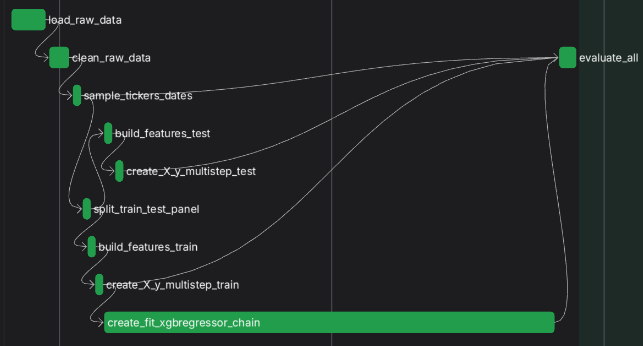

# Documentation

## Training Pipeline

### Workflow Orchestration
Training workflow (provided by the [main_training.py](../main_training.py) )  will first prepare the features for model training and start fitting the model as soon as the training data is ready. Preparation of the test data will start only after initiation of model training (which is the most time consuming task), and will run in parallel, as demonstrated here for a test run:
  
  
